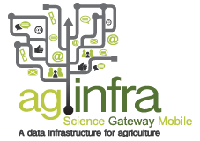
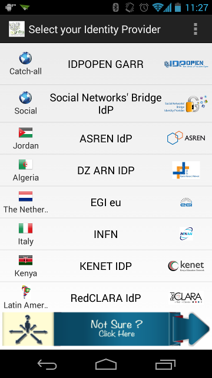
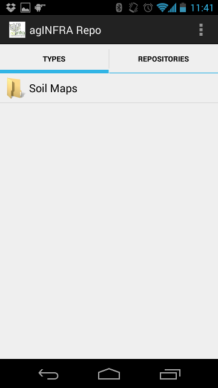
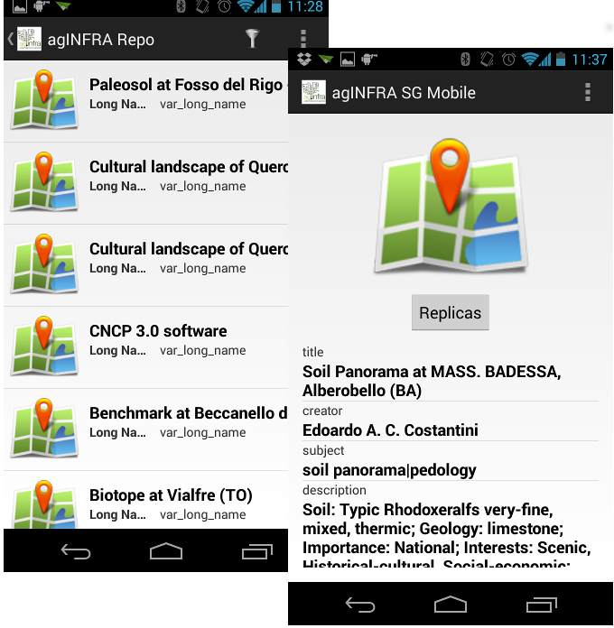

******************
AGINFRA SG MOBILE
******************

============
About
============

.. _PROJECT-URL:    http://www.aginfra.eu/
.. _SG-URL:         https://aginfra-sg.ct.infn.it/
.. _PLAY:           https://play.google.com/store/apps/details?id=it.infn.ct.aginfrasgmobile

-------------

**agINFRA SG Mobile** is a mobile application developed in the contest of `agINFRA project <PROJECT-URL_>`_. The Android version is available from `Google Play <PLAY_>`_. The main aim of this mobile app is to provide an easy way to access, from your mobile appliances, digital assets and metadata stored in different kinds of storage:

- Local storage
- Grid storage
- Cloud storage

The agINFRA SG Mobile currently provides access to the Soil Map data repository.

============
Installation
============

To install agINFRA SG Mobile on your devices simply download the app from the store

|PLAY-STORE|

or scan the following QR code 

|ANDROID-QR| 

============
Usage
============

To use the agINFRA SG Mobile you need federated credentials issued by an Identity Provider. If the organisation you belong to has an Identity Provider, proceed with the download; otherwise, you can first get federated credentials registering to the `"open" Identity Provider <https://idpopen.garr.it/register>`_, which belongs to the GrIDP federation.

Once the application is installed on you mobile device, you can access the repository using your federated credentials and selecting the organization you belong to and the Identity Provider (see `Figure 1`_).

.. _Figure 1:

   
   Identity Provider List

If your credentials are correct, the application shows the main view from which you could access the repository, as the `Figure 2`_ shows.

.. _Figure 2:

   
   agINFRA Soil Map Repository

Selecting the repository, the application shows a list of available digital assets (see Figure 3) from which you could select the digital object. The application provides also a hierarchical filter mechanism that allows you to easly retreive the asset and metadata you are looking for.

The `Figure 3`_ also shows the replica where the digital asset is available to download it on your device.

.. _Figure 3:

   Asset download

============
Contributors
============

    Antonio CALANDUCCI

    Mario TORRISI

.. Please feel free to contact us any time if you have any questions or comments.

.. _INFN: http://www.ct.infn.it/
.. _DFA: http://www.dfa.unict.it/
.. _ARN: http://www.grid.arn.dz/

.. :Authors:

.. `Mario TORRISI <mailto:mario.torrisi@ct.infn.it>`_ - University of Catania (DFA_),

.. `Antonio CALANDUCCI <mailto:antonio.calanducci@ct.infn.it>`_ - Italian National Institute of Nuclear Physics (INFN_),
